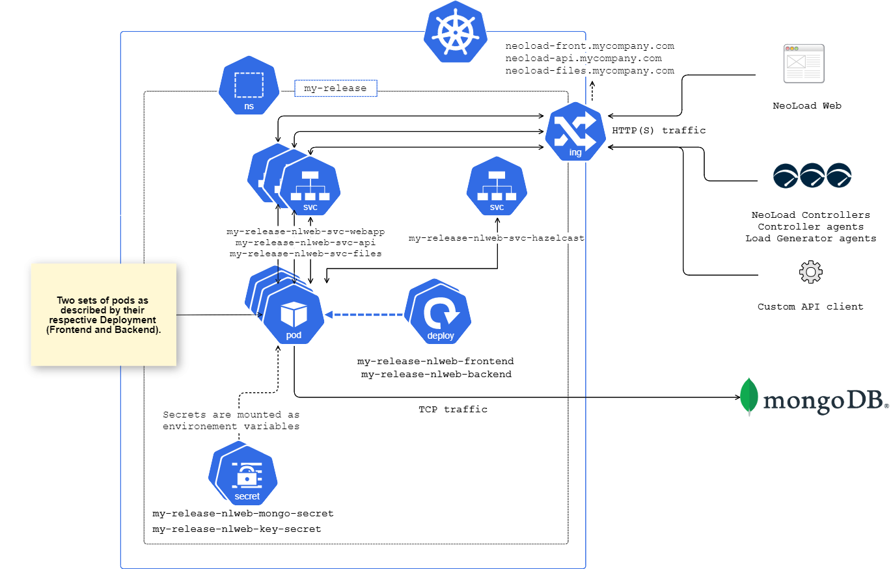

# Neoload Web

[Neoload Web](https://www.neotys.com/neoload/overview) allows testing teams to view, analyze and monitor tests wherever they're running from and wherever the teams are. Enabling real-time access to this information improves anomaly detection by allowing performance trending and simplifying root cause analysis. 

SaaS version is available [here](https://neoload.saas.neotys.com/) 

**Key features**

- Share a centralized view of the tests from anywhere in the world in real time
- Monitor big trends with graphs
- Get a closer look by diving into the details of a test
- Test data is hosted in the NeoLoad Web Cloud: tests can be accessed even when the NeoLoad Controller which launched them is not available

## Introduction

This chart deploys Neoload Web on your Kubernetes cluster.

## Targeted audience

This chart is meant for experimented Kubernetes/Helm users as a successful installation and exploitation of the application is very environment dependant.

## Prerequisites

### Hardware

NeoLoad Web will run in a pod that requires the following minimal resources :
- cpu 2
- memory 4Gi

> You will need to provision a node in your cluster that can host such a pod.
### Software

- [kubectl](https://kubernetes.io/docs/tasks/tools/install-kubectl/) CLI (1.14+)
- [Helm](https://helm.sh/docs/intro/install/) CLI  (~3.0.2)
- A running [Kubernetes](https://kubernetes.io/) cluster (1.14+)
- A running [mongodb](https://www.mongodb.com/) accessible from the Kubernetes cluster ([see supported versions](https://www.neotys.com/documents/doc/nlweb/latest/en/html/#26054.htm#o39020))
- A running ingress controller deployed on the Kubernetes cluster

#### Ingress controller

You can use your favorite [ingress controller](https://kubernetes.io/docs/concepts/services-networking/ingress-controllers/) for enabling your ingresses to route external traffic to NeoLoad Web.

This chart is tested, maintained and shipped with default values for the [**nginx**](https://hub.helm.sh/charts/bitnami/nginx) ingress controller.

You can find detailed documentation for nginx ingress controller annotations and parameters [here](https://kubernetes.github.io/ingress-nginx/).

> **Caution**: Using another ingress controller may require additional chart tuning from your part.

## Installation

1. Add the Neotys chart repository or update it if you already had it registered

```bash		
helm repo add neotys https://helm.prod.neotys.com/stable/
```

```bash		
helm repo update
```

2. Download and set up your **[values-custom.yaml](/values-custom.yaml)** file
3. Create a dedicated namespace

```bash		
kubectl create namespace my-namespace
```

4. Install with the following command

```bash		
helm install my-release neotys/nlweb -n my-namespace -f ./values-custom.yaml
```

> Since Helm 3.2+ you can skip step 3, and add the --create-namespace option to this command

## Uninstalling the Chart

To uninstall the `my-release` deployment:

```bash
$ helm uninstall my-release -n my-namespace
```

## Architecture

This schema describe:
* Components created inside the kubernetes cluster by this chart
* How they interact between them
* How they interact with components outside the cluster:
  * NeoLoad Web UI through a web browser
  * NeoLoad Controller
  * NeoLoad Load Generator
  * Any integration based on NeoLoad Web API
  * MongoDB server




## Configuration

Parameter | Description | Default
----- | ----------- | -------
`image.backend.repository` | The backend image repository to pull from | `neotys/neoload-web-backend`
`image.backend.pullPolicy` | The backend image pull policy | `IfNotPresent`
`image.backend.tag` | The backend image tag | `latest`
`image.frontend.repository` | The frontend image repository to pull from | `neotys/neoload-web-backend`
`image.frontend.pullPolicy` | The frontend image pull policy | `IfNotPresent`
`image.frontend.tag` | The frontend image tag | `latest`
`imagePullSecrets` | The image pull secrets | `[]`
 |  | 
`serviceAccount.create` | Specifies whether a service account should be created | `true`
`serviceAccount.name` | The name of the service account to use | 
 |  | 
`podSecurityContext`| The pod security context | `{ fsGroup: 2000 }`
`securityContext` | The security context | `{ runAsUser: 2000 }`
 |  | 
`services.webapp.host` | The hostname for the webapp/front deployment | 
`services.webapp.type` | The service type for the webapp/front deployment | `ClusterIP`
`services.webapp.port` | The service port for the webapp/front deployment | `80`
`services.webapp.ingress.paths` | The path mapping for the webapp/front ingress | `[""]`
`services.api.host` | The hostname for the api deployment | 
`services.api.type` | The service type for the api deployment | `ClusterIP`
`services.api.port` | The service port for the api deployment | `80`
`services.api.ingress.paths` | The path mapping for the api ingress | `[""]`
`services.files.host` | The hostname for the files deployment | 
`services.files.type` | The service type for the files deployment | `ClusterIP`
`services.files.port` | The service port for the files deployment | `80`
`services.files.ingress.paths` | The path mapping for the files ingress | `[""]`
 |  | 
`ingress.enabled` | Enable ingresses | `true`
`ingress.class` | Specifies which ingress controller class should listen to this ingress | `nginx`
`ingress.annotations` | Annotations for configuring the ingress | 
`ingress.tls[0].secretName` | The name of your TLS secret | 
`ingress.tls[0].secretCertificate` | The content of your imported certificate | `{}`
`ingress.tls[0].secretKey` | The content of your imported private key | 
 |  | 
`resources.backend.requests.cpu` | CPU resource request for the backend | `1`
`resources.backend.requests.memory` | Memory resource request for the backend | `2Gi`
`resources.backend.limits.cpu` | CPU resource limit for the backend | `2`
`resources.backend.limits.memory` | Memory resource limit for the backend | `3Gi`
`resources.frontend.requests.cpu` | CPU resource request for the frontend | `1`
`resources.frontend.requests.memory` | Memory resource request for the frontend | `1500Mi`
`resources.frontend.limits.cpu` | CPU resource limit for the frontend | `2`
`resources.frontend.limits.memory` | Memory resource limit for the frontend | `2Gi`
 |  | 
`neoload.configuration.backend.mongo.host` | MongoDB host | 
`neoload.configuration.backend.mongo.port` | MongoDB port | `27017`
`neoload.configuration.backend.mongo.poolSize` | MongoDB pool size | `50`
`neoload.configuration.backend.java.xmx` | Java JVM Max heap size for the backend | `2000m`
`neoload.configuration.backend.misc.files.maxUploadSizeInBytes` | Max file upload size in bytes | `250000000`
`neoload.configuration.backend.misc.files.maxUploadPerWeek` | Max file upload count per week | `250`
`neoload.configuration.backend.others` | Custom backend environment variables. [See](#custom-environment-variables) | |
`neoload.configuration.frontend.java.xmx` | Java JVM Max heap size for the frontend | `1200m`
 |  | 
`neoload.configuration.frontend.others` | Custom frontend environment variables. [See](#custom-environment-variables) | |
`mongodb.usePassword` | Set to false if your MongoDB connection doesn't require authentication | `true`
`mongodb.mongodbUsername` | MongoDB Username | 
`mongodb.mongodbPassword` | MongoDB Password | 
 |  | 
`nodeSelector` | Node Selector | `{}`
`tolerations` | Pod's tolerations | `[]`

We suggest you maintain your own *values-custom.yaml* and update it with your relevant parameters, but you can also specify each parameter using the `--set key=value[,key=value]` argument to `helm install`. For example,

```bash
$ helm install my-release \
    --set ingress.tls=[] \
    neotys/nlweb
```

## Custom environment variables

`neoload.configuration.backend.others` and `neoload.configuration.frontend.others` sections of *values-custom.yaml* allow to define custom environement variables.
These environement variables will be applied either on the backend or the frontend depending on the used property.

### Example

The following example will define `ENV_VAR_1` and `ENV_VAR_2` as environement variables for the backend deployment.

```yaml
neoload:
  configuration:
    backend:
      mongo:
        host: YOUR_MONGODB_HOST_URL
        port: 27017
      other:
        ENV_VAR_1: variable1 
        ENV_VAR_2: variable2

```

## TLS

To enable TLS and access Neoload Web via https, the parameters :

- `ingress.enabled` must be true
- `ingress.tls` must contain at least one item with the tls secret data

> **Caution**: Ingresses support multiple TLS mapped to respective hosts and paths. This feature is not supported for Neoload Web, i.e. exactly zero or one TLS configuration is expected.

### Using an existing tls secret

Simply refer to your secret in the `ingress.tls[0].secretName` parameter, and leave both `ingress.tls[0].secretCertificate` and `ingress.tls[0].secretKey` empty.

### Creating a new tls secret

#### Provide a certificate and a private key

Use the following documentation or use your own means to provide both a certificate and a private key.

- [Kubernetes TLS Secret generation documentation](https://kubernetes.github.io/ingress-nginx/user-guide/tls/)

#### Add these to your custom values file

Copy the content of the files into the `ingress.tls[0].secretCertificate` and `ingress.tls[0].secretKey` parameters.

#### Specify your new tls secret name

Set a name for your new tls secret name into the `ingress.tls[0].secretName` parameter.
